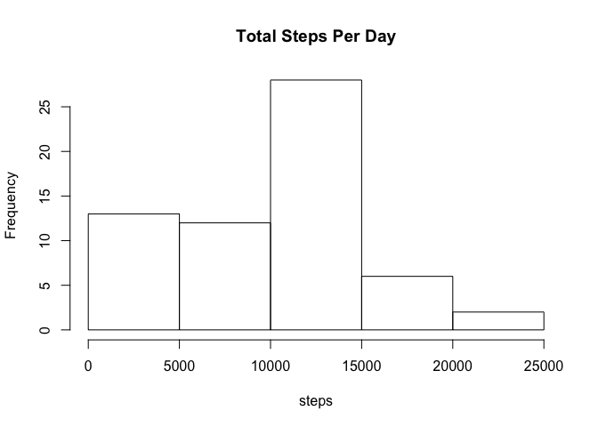
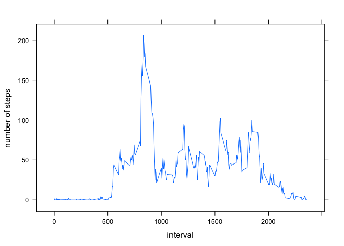
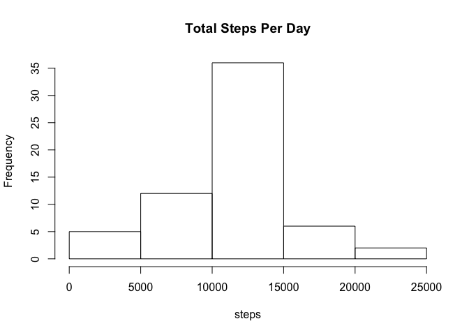
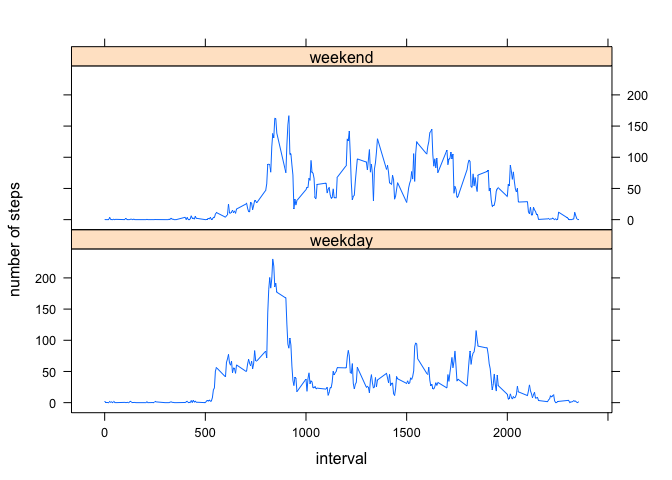

# Reproducible Research: Peer Assessment 1


In this project, we will examine a data set containing activity data generated by a personal fitness monitoring device. The device records number of steps throughout the day.

### Loading and preprocessing the data
We first read the activity data and examine the first several lines.

```r
temp.file <- tempfile()
download.file(
    "https://d396qusza40orc.cloudfront.net/repdata%2Fdata%2Factivity.zip",
    temp.file)
con <- unz(temp.file, "activity.csv")
DF <- read.csv(con)
unlink(temp.file)
head(DF)
```

```
##   steps       date interval
## 1    NA 2012-10-01        0
## 2    NA 2012-10-01        5
## 3    NA 2012-10-01       10
## 4    NA 2012-10-01       15
## 5    NA 2012-10-01       20
## 6    NA 2012-10-01       25
```

```r
n <- nrow(DF)
```
This data set contains 17568 observations of the number of steps in five-minute intervals though 61 days. The intervals are given as number of minutes in the day (past midnight); the variable interval increases from 0 to 2355 for each date given in the data set.  

### What is mean total number of steps taken per day?
Here, we build a histogram showing mean number of steps per day, and find the mean and median number of steps per day:

```r
DF2 <- group_by(DF, date)
DF3 <- 
    summarize(DF2, steps.per.day = sum(steps, na.rm = TRUE))
hist(DF3$steps.per.day,
     xlab="steps", main="Total Steps Per Day")
```

<!-- -->

```r
v1 <- mean(DF3$steps.per.day, na.rm = TRUE)
s1 <- format(v1, digits=2)
v2 <- median(DF3$steps.per.day, na.rm = TRUE)
s2 <- format(v2, digits=2)
```
It turns out that the mean number of steps per day is 9354, and the median number of steps per day is 10395.

### What is the average daily activity pattern?
Here, we look at the average number of steps in five minutes, through the course of a day; the average number of steps is computed over the 61 days of the data for each 5-minute interval of the day (excepting missing values, which are removed).

```r
DF4 <- group_by(DF, interval)
DF5 <- 
    summarize(DF4, ave.steps = mean(steps, na.rm = TRUE))
library(lattice)
xyplot(ave.steps ~ interval, data = DF5, 
       type="l", layout = c(1,1), ylab="number of steps")
```

<!-- -->

We can find the interval (during the course of a day) with the maximum average number of steps.

```r
i <- which.max(DF5$ave.steps)
v3 <- DF5$interval[i]
s3 <- format(v3, digits=2)
v4 <- DF5$ave.steps[i]
s4 <- format(v4, digits=2)
```
It turns out that the 5-minute interval beginning at 835 minutes is the one with the maximum average number of steps; the maximum average number of steps being 206.

### Imputing missing values
We first count missing values (NAs):

```r
count.na <- sum(is.na(DF$steps))
```
There are 2304 missing values.

We now adopt the following strategy for imputing missing values of the variable steps: replace them with the average number of steps as computed above.

```r
DF$steps.imp <- DF$steps
n <- length(DF$steps)
for (i in 0:(n-1)) {
    j <- (i %% 288) + 1
    if (is.na(DF$steps[i+1])) {
        DF$steps.imp[i+1] <- DF5$ave.steps[j]
    }
}
```
We now draw a histogram of average number of steps per day, which may be compared with the histogram drawn above for the data with missing values removed:

```r
DF6 <- group_by(DF, date)
DF7 <- 
    summarize(DF6, steps.per.day.imp = sum(steps.imp))
hist(DF7$steps.per.day.imp,
     xlab="steps", main="Total Steps Per Day")
```

<!-- -->

We can compare the mean and median number of steps per day with the values obtained above (with missing values removed not imputed). 

```r
v5 <- mean(DF7$steps.per.day.imp)
s5 <- format(v5, digits=2)
v6 <- median(DF7$steps.per.day.imp)
s6 <- format(v6, digits=2)
```
The mean and median number of steps per day are respectively 10766 and 10766. Recall the mean and median above were 9354 and 10395 respectively.

### Are there differences in activity patterns between weekdays and weekends?
Here, we create a new variable, daytype, with two values: weekdays and weekend. This is accomplished by a function that returns "weekend" if the date turns out to be Saturday or Sunday, and "weekday" otherwise. The data set is then grouped by weekend and weekday, and the average daily activity is found and plotted for these two cases.

```r
daytype <- function(d) {
    if (weekdays(as.Date(d)) %in% c("Saturday","Sunday")) {
        return("weekend")
    } else {
        return("weekday")
    }
}
DF$daytype <- sapply(DF$date, daytype)
DF8 <- group_by(DF, daytype, interval)
DF9 <- summarize(DF8, ave.steps = mean(steps.imp))
xyplot(ave.steps ~ interval | daytype, data = DF9, 
       type="l", layout = c(1,2), ylab="number of steps")
```

<!-- -->

It appears that weekdays have less activity during the day, but they have a good bit of activity at around 8:30 a.m.; weekends have a roughly constant amount of activity all day long.
